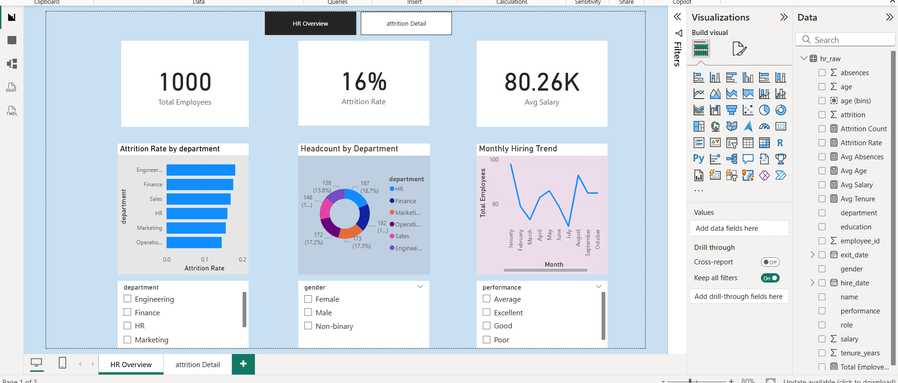
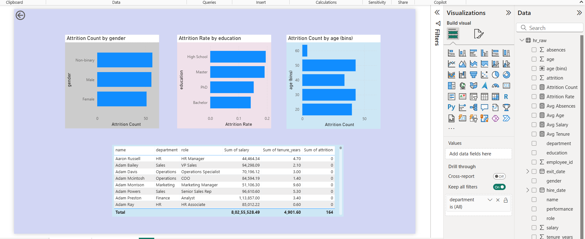
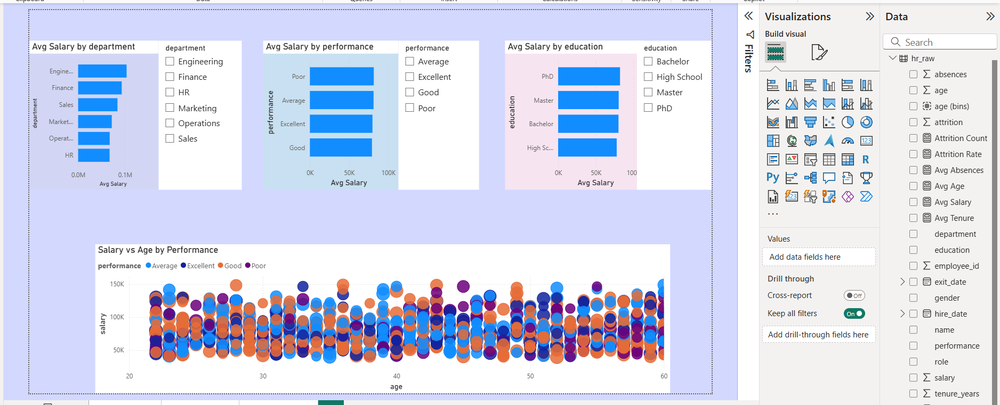

# HR Analytics Dashboard | SQL + Python + Excel + Power BI 

## Overview
This project analyzes HR data to identify employee attrition, workforce diversity, salary distribution, hiring trends, and department performance. The dashboard helps HR teams make data-driven decisions.

## Tools & Technologies
- SQL Server
- Python (Pandas, NumPy, Matplotlib, Seaborn)
- Excel
- Power BI
- Git & GitHub

## Dataset
- 1000 Employee Records
- Employee ID
- Department
- Gender
- Age
- Salary
- Performance Rating
- Attrition Status
- Tenure

## Dashboard Features
- Employee Attrition Analysis
- Department-wise Performance
- Salary Analysis
- Workforce Diversity
- Hiring vs Attrition Trend
- Interactive Filters

## Dashboard Preview

### Dashboard 1

### Dashboard 2

### Dashboard 3

## Key Findings
- Overall employee attrition rate: 16.4%
- Sales department has the highest attrition.
- Employees with low tenure leave more frequently.
- Most employees fall in the medium salary band.

## KPIs Tracked
- Attrition rate (overall and by department)
- Headcount over time
- Average tenure by department
- Salary band distribution
- Diversity breakdown (gender, age group)
- Performance rating distribution
- Hiring vs. attrition trend

## Project Structure
- `sql/` — data creation and transformation queries
- `python/` — data generation script and EDA notebook
- `excel/` — KPI reference model
- `powerbi/` — dashboard file (.pbix)
- `exports/` — screenshots, PDF, and EDA charts

## Screenshots
(add after Phase )

## Conclusion
This project demonstrates end-to-end data analytics using SQL, Python, Excel, and Power BI to generate meaningful HR insights and support business decision-making.